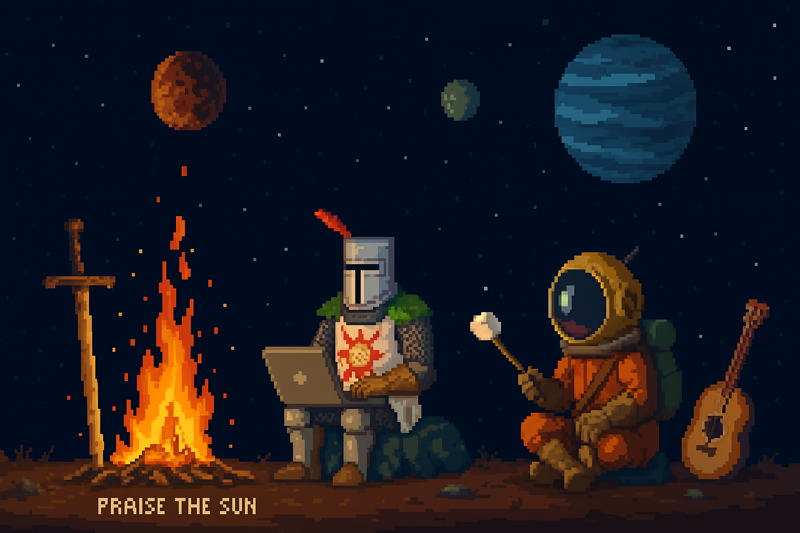

## 🏹 🌑 Hey there! I'm Guillermo 👋

> *"Prepare to code."*

I'm a **software engineer** with experience working in the **fintech** industry, where I’ve learned to balance clean, elegant code with robust, secure solutions — just like a knight balancing a heavy shield in front of Ornstein and Smough 🛡️⚔️.

### 🚀 About me

- 💻 Passionate about crafting web experiences that feel as smooth and satisfying as a perfectly timed parry in **Dark Souls**.
- 💡 Always seeking to refine and optimize my code — because there’s nothing quite like discovering a hidden shortcut that changes the entire journey.
- 🔎 Endlessly curious about new technologies and ideas, much like unraveling the cosmic mysteries scattered across the universe in **Outer Wilds**.

### ⚡ Tech stack

- **Frontend:** React, Next.js, Tailwind CSS
- **Backend:** Python, FastAPI
- **Databases:** PostgreSQL
- **Others:** Git, CI/CD, Docker, AWS

### 🌌 What drives me

I love tackling complex problems and finding creative solutions (there’s nothing more rewarding than discovering that hidden bonfire or decoding a distant star’s mystery). To me, coding is an adventure: every bug is a boss fight, and every new feature is a new planet waiting to be explored.

### 🎮 Fun facts

- I play *Dark Souls* to remind myself that no challenge is insurmountable with patience and perseverance.
- *Outer Wilds* taught me that curiosity is the key to discovering incredible things.
- I’m always looking to join teams that value creativity and continuous improvement.

### 📫 Connect with me

- 💌 [Email](mailto:grmbio7@gmail.com)
- 💼 [LinkedIn](www.linkedin.com/in/guillermo-rodríguez-moreno-b91568272)

---

